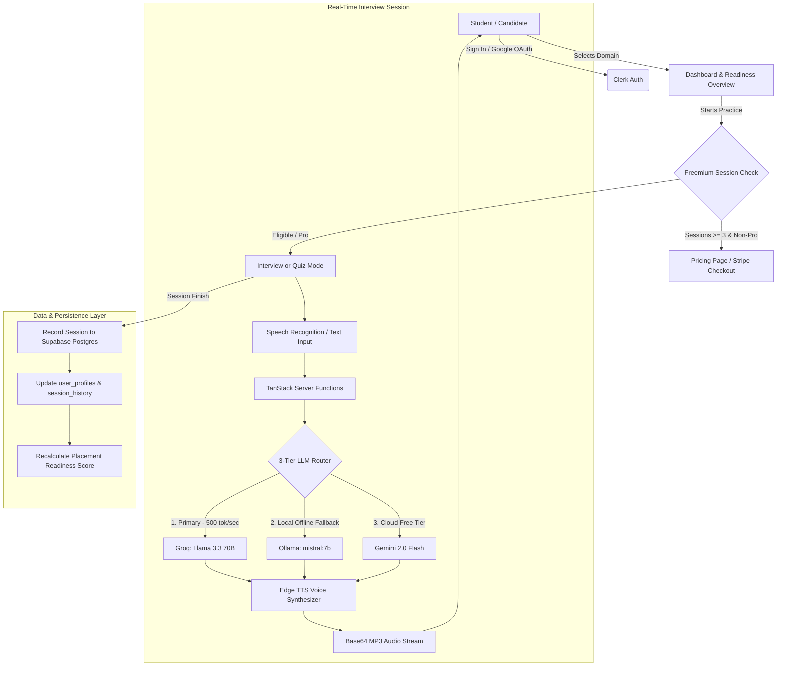

# MockMate — AI Mock Interview Platform for Tech Placements

> **The AI-powered placement interview coach engineered for Indian CS freshers to ace technical interviews in DSA, Spring Boot, System Design, and LLD.**
>
> 📖 **Quick Setup Guide:** See [HOW_TO_RUN.md](file:///home/nrishan/Documents/projects/MGT-PROJECT/HOW_TO_RUN.md) for step-by-step instructions on running locally or setting up free API keys.

---

## 🚀 One-Line Value Proposition

**MockMate** transforms technical interview anxiety into placement readiness through conversational voice-based AI mock sessions, canonical campus rubrics, and continuous cross-session readiness tracking.

---

## 📌 The Problem & Market Opportunity

Over **1.5 million engineering students** graduate in India annually. During campus hiring season (TCS Digital, Infosys SP, Amazon, Tier-1/2 product companies, and fast-growing tech startups), **over 75% of candidates get eliminated in technical interview rounds**.

- **Not a Coding Deficit, but an Articulation Deficit:** Students grind LeetCode questions in silence, but fail when asked to verbally walk through time complexities, justify trade-offs, or defend architectural decisions.
- **Human Mentorship is Expensive & Unscalable:** Professional 1-on-1 mock interviews cost ₹2,000–₹5,000 per session—prohibitive for average college students.
- **Generic AI Chatbots Fall Short:** ChatGPT gives away the answer immediately rather than maintaining an authentic, probing interviewer persona.

---

## 💡 The MockMate Solution

MockMate bridges the gap between solitary coding practice and real-world high-stakes interviews:

1. **Conversational Voice Interviews:** Powered by Microsoft Edge TTS for human-like natural interviewer voice narration and Web Speech API for candidate speech recognition.
2. **Curated Canonical Domains:** Dedicated 15+ canonical question tracks tailored specifically to Indian campus placements:
   - **Data Structures & Algorithms (DSA):** Tree traversals, DP memoization, Graph cycles, Sliding window complexities.
   - **Spring Boot & Java Backend:** IoC & DI, JPA N+1 problem, `@Transactional` boundaries, Actuator, HikariCP.
   - **System Design (HLD):** CAP theorem, consistent hashing, caching strategies, rate limiting, and sharding.
   - **Low-Level Design (LLD):** SOLID principles, design patterns (Factory, Strategy, Observer, Decorator), and schema design.
3. **Multi-Metric Evaluation Engine:** Generates instant diagnostic scorecards covering Technical Depth, Communication, Problem Solving, strengths, weaknesses, and actionable improvement recommendations.
4. **Placement Readiness Score:** A proprietary diagnostic algorithm aggregating cross-session performance and domain coverage into a single readiness percentage (0–100%).
5. **Freemium Business Model:** 3 free starter sessions, with seamless upgrade to **MockMate Pro (₹499/month)** integrated with Stripe Checkout in test mode.

---

## ⚡ Technical Architecture & Innovations



### Key Technical Differentiators

| Layer | Technology | Why It Matters |
|---|---|---|
| **Text-to-Speech** | **Microsoft Edge TTS** | 100% free, natural neural voices (`en-US-AriaNeural`), zero external API keys or token limits. |
| **LLM Router** | **Groq → Ollama → Gemini** | 3-tier failover with a 30s global deadline. Groq provides ultra-fast inference (~500 tokens/sec), Ollama enables private offline usage, and Gemini 2.0 Flash provides Google AI Studio reliability. |
| **Authentication** | **Clerk** | Drop-in Google OAuth & Email auth with custom session bridge and 1-click Demo mode. |
| **Database** | **Supabase Postgres** | Persistent storage for `user_profiles`, `session_history`, and credit management. |
| **Monetization** | **Stripe Checkout** | Test-mode card simulation (`4242 4242 4242 4242`) for automated Pro status upgrades. |
| **Design System** | **Tailwind CSS v4 + Vanilla CSS** | Polished Light & Dark modes, subtle minimal 64px SaaS grid, responsive mobile navigation. |

---

## 💰 Business Model: Freemium Unit Economics

MockMate operates on a high-margin freemium SaaS model:

- **Free Tier (Student Starter):**
  - 3 full mock sessions (interviews or quizzes).
  - Standard Edge TTS voice interviewer.
  - Basic technical depth evaluation.
  - Cost per free user: ~₹0.15 (Groq free tier + Edge TTS serverless compute).

- **MockMate Pro (₹499 / month or ₹2,999 / year):**
  - Unlimited voice mock interviews & quizzes across all 4 domains.
  - Priority Groq Llama 3.3 70B inference.
  - Granular communication & pacing breakdown.
  - Placement Readiness Score with personalized diagnostic weakness targeting.
  - Gross Margin: **>90%** due to efficient model routing and free Edge TTS synthesis.

---

## 🛠️ Step-by-Step Setup Guide

### 1. Prerequisites
- Node.js 18+ (tested on Node v22)
- npm or bun

### 2. Clone and Install
```bash
git clone https://github.com/njd07/interv-ai.git mockmate
cd mockmate
npm install --ignore-scripts --no-audit --no-fund
```

### 3. Environment Variables Configuration
Create a `.env` file in the project root:

```env
# ─── 1. LLM API Keys (At least one is required) ───
# Groq (Primary — Free & Fastest, get from https://console.groq.com)
GROQ_API_KEY=gsk_your_groq_key

# Google Gemini (Fallback — Free tier, get from https://aistudio.google.com/apikey)
GEMINI_API_KEY=AIzaSy_your_gemini_key

# ─── 2. Clerk Authentication ───
# Get keys from https://dashboard.clerk.com
VITE_CLERK_PUBLISHABLE_KEY=pk_test_your_clerk_key
CLERK_SECRET_KEY=sk_test_your_clerk_secret

# ─── 3. Supabase Postgres Database ───
# Get credentials from https://supabase.com/dashboard/project/_/settings/api
SUPABASE_URL=https://your-project.supabase.co
SUPABASE_SERVICE_ROLE_KEY=your_service_role_key
# Run supabase/schema.sql in the Supabase SQL editor to create the tables.

# ─── 4. Stripe (Test Mode) ───
# Get test keys from https://dashboard.stripe.com/test/apikeys
STRIPE_SECRET_KEY=sk_test_your_stripe_secret
VITE_STRIPE_PUBLISHABLE_KEY=pk_test_your_stripe_publishable
STRIPE_PRICE_ID=price_your_test_price_id
```

> **Note on Zero-Config Demo Mode:**
> MockMate is built to run out-of-the-box! If Clerk or Supabase keys are omitted during evaluation, MockMate automatically activates its **Interactive Demo Mode** (1-click candidate login, local memory persistence, and simulated Stripe checkout).

### 4. Running Locally
```bash
npm run dev
```
The web app will start on `http://localhost:3000` (or `http://localhost:5173`).

### 5. Running Automated Checks
```bash
# Verify TypeScript build
npx tsc --noEmit

# Production bundle build
npm run build
```

---

## 🚢 Deployment to Vercel

MockMate is optimized for 1-click deployment to **Vercel**:

1. Push your repository to GitHub.
2. Go to [vercel.com](https://vercel.com) and click **"Add New Project"**.
3. Import your repository.
4. Add the environment variables (`GROQ_API_KEY`, `GEMINI_API_KEY`, `VITE_CLERK_PUBLISHABLE_KEY`, `SUPABASE_URL`, `SUPABASE_SERVICE_ROLE_KEY`, `STRIPE_SECRET_KEY`).
5. Click **Deploy**.

---

## 📄 License
MIT License. Created for the Technology Entrepreneurship Course Evaluation.
