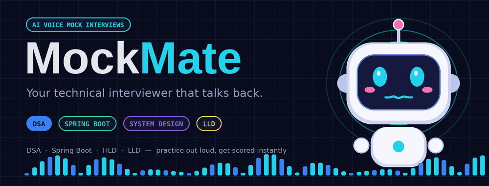
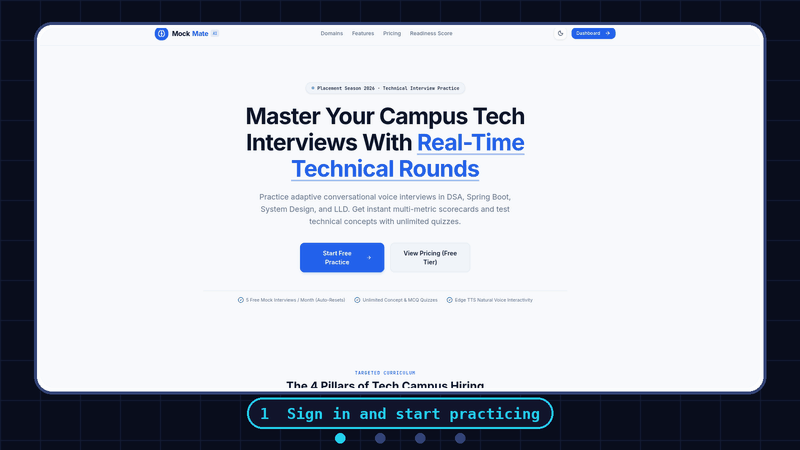
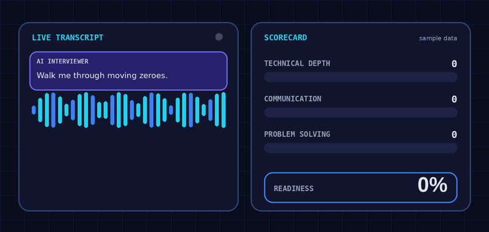
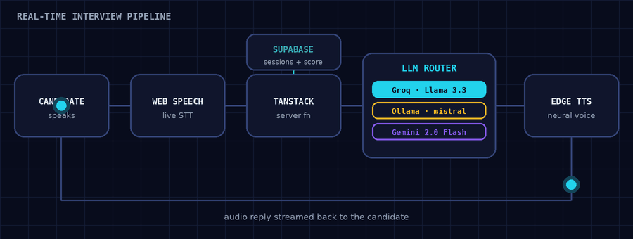
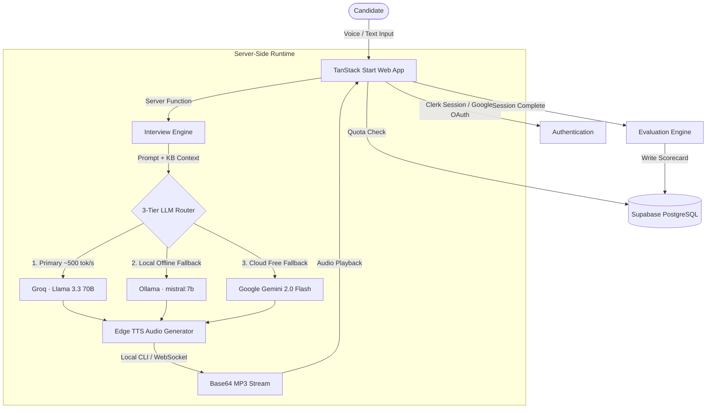

<div align="center">



<br>

[](https://mockmate-phi-gray.vercel.app)
[](#tech-stack)
[](#architecture)
[](LICENSE)

### AI voice interviewer for CS students preparing for technical placements.
Practice DSA, Spring Boot, System Design, and LLD out loud — with real-time feedback, probing follow-ups, and diagnostic scorecards.

[**Launch Web App**](https://mockmate-phi-gray.vercel.app) · [Product Tour](#product-tour) · [How It Works](#how-it-works) · [Architecture](#architecture) · [Pricing & Economics](#pricing--unit-economics) · [Run Locally](#local-setup)

</div>

---

## Why MockMate?

LeetCode and GeeksforGeeks teach you how to write code in a silent browser tab. Real campus placement interviews test something completely different: **whether you can think and articulate under pressure while someone evaluates your approach.**

When companies like Amazon, TCS Digital, Infosys SP, and product startups conduct technical rounds, over **75% of candidates are rejected** in the verbal problem-solving stage. Most of the time, it is not because the candidate didn't know the logic. It is because:

1. **They can't speak their thought process:** They jump straight into code without explaining their approach, time/space trade-offs, or edge cases out loud.
2. **1-on-1 human mocks are too expensive:** Platforms charge ₹2,000 to ₹5,000 per mock session, making regular practice unaffordable for most college students.
3. **Chatbots don't act like interviewers:** Standard LLM chats hand over the solution after one prompt instead of pushing you to justify decisions, handle follow-ups, and defend trade-offs.

MockMate runs full voice-based mock interviews with an adaptive AI interviewer that listens, asks follow-up questions, points out weak spots, and tracks your readiness across rounds.

---

## Product Tour

<div align="center">

</div>

- **Voice & Speech Recognition:** The interviewer asks questions using neural Edge TTS voices (`en-US-ChristopherNeural`, `Jenny`, `Guy`, `Prabhat`). You answer out loud using browser speech recognition with real-time waveform visualization.
- **Dynamic Question Progression:** Each interview runs 5 rounds. For DSA, questions actively balance fundamental patterns (Two Pointers, Sliding Window, and Hashing) before diving into Trees, Graphs, and Dynamic Programming.
- **Concept Quizzes:** Practice targeted multiple-choice questions focused on algorithm identification and Big-O complexity analysis, with randomized option distribution on every attempt.
- **Cross-Session Placement Readiness:** Your performance aggregates into a 0–100% readiness score with domain-specific breakdowns so you know where you stand before interview day.

---

## Technical Tracks

MockMate covers the four core areas tested in university campus drives and junior SWE interviews:

| Track | Key Areas Tested |
|---|---|
| **Data Structures & Algorithms** | Two Pointers (3Sum, Container With Most Water), Sliding Window (min window substring, distinct counts), Hashing & Prefix Sums (subarray sum equals K), Monotonic Stacks, Binary Search on answer space, Trees, Graphs, and DP. |
| **Spring Boot & Java Backend** | IoC and Bean lifecycles, Hibernate/JPA N+1 queries, `@Transactional` proxy boundaries and rollback rules, Spring Security filters, Actuator hardening, and Java 21 Virtual Threads. |
| **System Design (HLD)** | CAP theorem trade-offs, Consistent Hashing ring rebalancing, Cache stampede mitigation, distributed rate limiters (Token Bucket), Kafka partition ordering, and database sharding. |
| **Low-Level Design (LLD)** | SOLID principles in practice, design patterns (Strategy, Decorator, Observer, Command, Composite), concurrency hazards (Double-Checked Locking, thread safety), and object-oriented modeling. |

---

## How It Works

<div align="center">

</div>

1. **Start the Session:** Select a domain and start your interview. The system deducts 1 session from your monthly quota (5 free sessions per month, auto-renewed).
2. **Listen to the Problem:** The interviewer speaks the problem scenario aloud. A 10-second client race timeout guarantees audio playback even if network latency spikes, with a 1-click audio replay option.
3. **Speak Your Solution:** Hit the microphone or use keyboard shortcuts to explain your reasoning, time complexity, and data structure choices.
4. **Defend Follow-Ups:** The AI evaluates your answer and pushes you on corner cases, alternative approaches, or complexity trade-offs before moving to the next round.
5. **Get Graded:** Upon finishing, you receive a diagnostic scorecard covering **Technical Depth**, **Communication**, and **Problem Solving** alongside actionable feedback and recommendations.

---

## Architecture

<div align="center">

</div>


```mermaid
graph TD
    User([Candidate]) -->|Voice / Text Input| Client[TanStack Start Web App]
    Client -->|Clerk Session / Google OAuth| Auth[Authentication]
    Client -->|Quota Check| DB[(Supabase PostgreSQL)]
    
    subgraph Execution [Server-Side Runtime]
        Client -->|Server Function| RouteHandler[Interview Engine]
        RouteHandler -->|Prompt + KB Context| LLM{3-Tier LLM Router}
        LLM -->|1. Primary ~500 tok/s| Groq[Groq · Llama 3.3 70B]
        LLM -->|2. Local Offline Fallback| Ollama[Ollama · mistral:7b]
        LLM -->|3. Cloud Free Fallback| Gemini[Google Gemini 2.0 Flash]
        
        Groq --> SpeechService[Edge TTS Audio Generator]
        Ollama --> SpeechService
        Gemini --> SpeechService
        SpeechService -->|Local CLI / WebSocket| AudioStream[Base64 MP3 Stream]
    end

    AudioStream -->|Audio Playback| Client
    Client -->|Session Complete| ScoreEngine[Evaluation Engine]
    ScoreEngine -->|Write Scorecard| DB
```

### Tech Stack

- **Frontend & Full-Stack Framework:** [TanStack Start](https://tanstack.com/start) on React 19 and Nitro server engine for SSR hydration and type-safe server functions.
- **Styling & UI:** Tailwind CSS v4 with an engineering-focused grid layout, custom card translucency, and full light/dark mode support (defaults to light mode).
- **LLM Inference:** Primary router powered by [Groq](https://groq.com) running `llama-3.3-70b-versatile` (~500 tokens/sec), with fallbacks to local [Ollama](https://ollama.com) and [Google Gemini 2.0 Flash](https://ai.google.dev/).
- **Voice Synthesis:** Microsoft Edge TTS running locally via CLI and WebSocket fallback for natural human speech without paid third-party voice APIs.
- **Database & Storage:** [Supabase](https://supabase.com) PostgreSQL with Row-Level Security, automated monthly quota resets, and indexing.
- **Authentication:** [Clerk](https://clerk.com) with Google OAuth, email authentication, and an instant zero-config Demo Mode for previewing without setup.
- **Payments:** [Stripe Checkout](https://stripe.com) supporting credit cards, debit cards, and UPI.

---

## Pricing & Unit Economics

MockMate uses a student-first freemium model designed to keep operational costs low while remaining accessible.

| Feature | Free Starter | MockMate Pro |
|---|---|---|
| **Monthly Price** | **₹0** | **₹199 / month** (70% student discount) |
| Voice Mock Interviews | 5 / month (auto-resets every month) | **Unlimited** |
| Algorithm & MCQ Quizzes | Unlimited (never uses credits) | **Unlimited** |
| All 4 Interview Tracks | Included | Included |
| Core Evaluation Scorecards | Included | Included |
| Inference Priority | Standard | Priority Llama 3.3 70B |
| Articulation & Communication Diagnostics | Basic | In-depth |
| Readiness Score History | Included | Included |

- **Unit cost per free user:** ~₹0.15/month (leveraging Groq free tier quotas and free Edge TTS synthesis).
- **Gross margin on Pro:** Over 92% due to low-latency serverless routing and open voice generation.

---

## Local Setup & Getting Started

Follow these steps to clone the repository and run MockMate locally on your machine.

### 1. Prerequisites

- **Node.js**: Version 18 or higher (tested on Node 20, 22, and 24)
- **Package Manager**: `npm`, `pnpm`, or `bun`
- **Optional**: Python 3 with `edge-tts` (`pip install edge-tts`) for local neural voice synthesis (MockMate also includes an automatic fallback).

### 2. Clone the Repository

```bash
git clone https://github.com/njd07/mockmate.git
cd mockmate
```

### 3. Install Dependencies

```bash
npm install --ignore-scripts --no-audit --no-fund
```

---

### 4. Running Locally

You have two ways to run MockMate:

#### Option A: Quick Start (Zero-Config Demo Mode — Under 30 Seconds)

You can launch and explore MockMate immediately without signing up for external databases, auth providers, or payment gateways:

```bash
npm run dev
```

Open your browser at `http://localhost:3000` (or the port indicated in your console).

> **How Demo Mode Works:**  
> If environment variables are omitted, MockMate automatically activates **Interactive Demo Mode**:
> - **1-Click Candidate Login**: Test the dashboard and interview flow without setting up Clerk or Google OAuth.
> - **In-Memory Session Store**: Tracks candidate history and readiness scores during your session.
> - **Simulated Pro Checkout**: Test subscription flows with mock Stripe payments.
> - **Voice Synthesis**: Works out-of-the-box using neural Edge TTS voices.

---

#### Option B: Full Setup with Persistent Services (100% Free Tiers)

To connect real persistence, authentication, and custom AI API keys, create a `.env` file in the project root:

```bash
cp .env.example .env
```

Populate the environment variables in `.env`:

```env
# ─── 1. AI Providers (At least one required) ───
# Primary provider: Groq (Llama 3.3 70B, ~500 tok/sec) — Get free key at https://console.groq.com
GROQ_API_KEY=gsk_your_groq_api_key

# Fallback provider: Google Gemini 2.0 Flash — Get free key at https://aistudio.google.com/apikey
GEMINI_API_KEY=AIzaSy_your_gemini_api_key

# ─── 2. Authentication (Clerk) ───
# Get keys at https://dashboard.clerk.com (create application -> API Keys)
VITE_CLERK_PUBLISHABLE_KEY=pk_test_your_clerk_key
CLERK_SECRET_KEY=sk_test_your_clerk_secret

# ─── 3. Database (Supabase PostgreSQL) ───
# Get keys at https://supabase.com (project settings -> API)
SUPABASE_URL=https://your-project.supabase.co
SUPABASE_SERVICE_ROLE_KEY=your_supabase_service_role_key

# ─── 4. Payments (Stripe — Optional) ───
# Get test keys at https://dashboard.stripe.com/test/apikeys
STRIPE_SECRET_KEY=sk_test_your_stripe_secret
VITE_STRIPE_PUBLISHABLE_KEY=pk_test_your_stripe_publishable
STRIPE_PRICE_ID=price_your_test_price_id
```

##### Initializing the Database Tables:
If you are using Supabase:
1. Go to your **Supabase Dashboard** → **SQL Editor**.
2. Open [`supabase/schema.sql`](supabase/schema.sql) from this repository.
3. Paste the SQL script and click **Run**.
4. This creates the `user_profiles` and `session_history` tables with Row-Level Security and performance indexes.

Then start the application:

```bash
npm run dev
```

---

### 5. Useful Commands

```bash
# Start development server with hot reloading
npm run dev

# Run TypeScript typechecks
npx tsc --noEmit

# Build production bundle
npm run build
```

---

### 6. Tips & Browser Permissions

- **Microphone Access**: When starting an interview session, grant microphone permission in your browser so the Web Speech API can transcribe your verbal answers in real time.
- **Audio Output**: If you don't hear the interviewer's voice, ensure system volume is unmuted or click the **"Replay Audio"** button to trigger audio playback.

---

## License

MockMate is open-source software licensed under the [MIT License](LICENSE).

<div align="center">

Built by [Nrishan Jyoti Das](https://github.com/njd07) · [Live Demo](https://mockmate-phi-gray.vercel.app)

</div>
