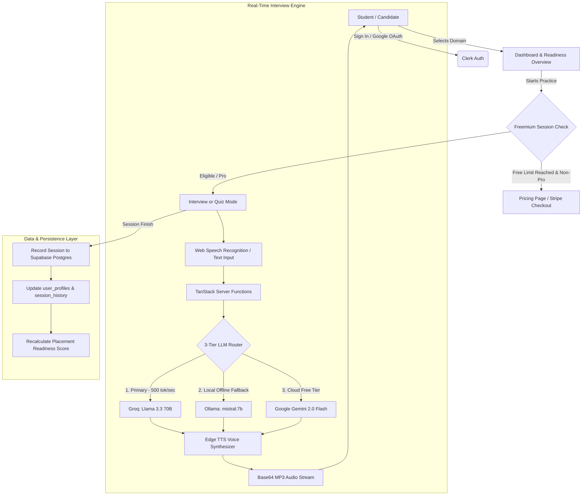

# MockMate — AI Mock Interview Platform for Tech Placements

[](https://mockmate-phi-gray.vercel.app)
[](https://mockmate-phi-gray.vercel.app)
[](LICENSE)

> **The AI-powered placement interview coach engineered for CS students and freshers to ace high-stakes technical interviews in DSA, Spring Boot, System Design (HLD), and Low-Level Design (LLD).**
>
> 🌐 **Live Demo:** [https://mockmate-phi-gray.vercel.app](https://mockmate-phi-gray.vercel.app)  
> 📖 **Quick Setup Guide:** See [HOW_TO_RUN.md](file:///home/nrishan/Documents/projects/MGT-PROJECT/HOW_TO_RUN.md) for local dev instructions and free API keys setup.

---

## 🚀 One-Line Value Proposition

**MockMate** transforms technical interview anxiety into placement readiness through conversational voice-based AI mock sessions, canonical campus rubrics, deep scenario-based problem solving, and cross-session readiness tracking.

---

## 📌 The Problem & Market Opportunity

Over **1.5 million engineering students** graduate in India annually. During campus hiring season (TCS Digital, Infosys SP, Amazon, Tier-1/2 product companies, and fast-growing tech startups), **over 75% of candidates get eliminated in technical interview rounds**.

- **Not a Coding Deficit, but an Articulation Deficit:** Students grind LeetCode questions in silence, but stumble when asked to verbally walk through time/space trade-offs, defend concurrency boundaries, or explain system architectures.
- **Human Mentorship is Expensive & Unscalable:** Professional 1-on-1 mock interviews cost ₹2,000–₹5,000 per session—completely out of reach for average college students.
- **Generic AI Chatbots Fall Short:** ChatGPT gives away solutions immediately rather than maintaining an authentic, rigorous, probing interviewer persona.

---

## 💡 The MockMate Solution

MockMate bridges the gap between solitary coding practice and real high-stakes campus interviews:

1. **Conversational Voice Interviews:** Powered by Microsoft Edge TTS for natural, human-like voice narration and Web Speech API for candidate speech input with a live audio visualizer.
2. **Resilient Speech Engine:** Client-side 4.5s race timeout with neural browser voice fallback and dedicated "Replay Audio" control.
3. **Curated Canonical Domains & Deep Scenarios:**
   - **Data Structures & Algorithms (DSA):** Cyclic graphs, DP memoization, BST balancing, sliding window edge cases.
   - **Spring Boot & Java Backend:** IoC/DI, JPA N+1 query problem, `@Transactional` isolation, Actuator metrics, HikariCP tuning.
   - **System Design (HLD):** CAP theorem, consistent hashing, distributed caching, rate limiters, database sharding.
   - **Low-Level Design (LLD):** SOLID principles, design patterns (Factory, Strategy, Observer, Decorator), clean class diagrams.
4. **Multi-Metric Evaluation Engine:** Instant diagnostic scorecards covering Technical Depth, Communication, Problem Solving, strengths, weaknesses, and actionable recommendations.
5. **Cross-Session Placement Readiness Score:** A proprietary diagnostic algorithm aggregating cross-session performance, domain coverage, and consistency into a 0–100% readiness rating.
6. **Student-Friendly Freemium Model:**
   - **5 Free Voice Mock Interviews / Month** (auto-resets every calendar month).
   - **Unlimited Concept & MCQ Quizzes** (100% free and unlimited, never consumes interview quotas).
   - **MockMate Pro (₹199 / month · 70% Student Discount):** Unlimited voice interviews with Stripe Checkout (Credit/Debit Cards + UPI dynamic payment methods).

---

## ⚡ Technical Architecture & System Design


```mermaid
graph TD
    A[Student / Candidate] -->|Sign In / Google OAuth| B(Clerk Auth)
    A -->|Selects Domain| C[Dashboard & Readiness Overview]
    C -->|Starts Practice| D{Freemium Session Check}
    D -->|Free Limit Reached & Non-Pro| E[Pricing Page / Stripe Checkout]
    D -->|Eligible / Pro| F[Interview or Quiz Mode]

    subgraph "Real-Time Interview Engine"
    F --> G[Web Speech Recognition / Text Input]
    G --> H[TanStack Server Functions]
    H --> I{3-Tier LLM Router}
    I -->|1. Primary - 500 tok/sec| J[Groq: Llama 3.3 70B]
    I -->|2. Local Offline Fallback| K[Ollama: mistral:7b]
    I -->|3. Cloud Free Tier| L[Google Gemini 2.0 Flash]
    J --> M[Edge TTS Voice Synthesizer]
    K --> M
    L --> M
    M --> N[Base64 MP3 Audio Stream]
    N --> A
    end

    subgraph "Data & Persistence Layer"
    F -->|Session Finish| O[Record Session to Supabase Postgres]
    O --> P[Update user_profiles & session_history]
    P --> Q[Recalculate Placement Readiness Score]
    end
```

### Key Technical Innovations

| Layer | Technology | Why It Matters |
|---|---|---|
| **Full Stack Framework** | **TanStack Start + React 19 + Nitro** | SSR hydration, type-safe full-stack server functions, and instant sub-second page transitions. |
| **Voice Synthesis** | **Microsoft Edge TTS + Browser Fallback** | 100% free natural neural voice (`en-US-AriaNeural`), zero external audio API fees, with a 4.5s client-side timeout fallback. |
| **LLM Router** | **Groq → Ollama → Gemini 2.0 Flash** | 3-tier failover with a 30s deadline. Groq provides ultra-fast inference (~500 tok/sec) for conversational latency. |
| **Authentication** | **Clerk** | Drop-in Google OAuth & Email auth with custom session bridge and zero-config 1-click Demo mode. |
| **Database & Quotas** | **Supabase PostgreSQL** | Schema with automated `last_reset_date` monthly resets, RLS policies, and performance indexes. |
| **Monetization** | **Stripe Checkout** | Dynamic payment methods supporting Cards + UPI AutoPay for student affordability. |
| **Design System** | **Tailwind CSS v4 + Technical Grid** | High-contrast Slate & Cobalt Blue theme with visible 40px grid backdrop, glassmorphism cards, and full light/dark support. |

---

## 💰 Business Model: Freemium Unit Economics

MockMate operates on a high-margin, scalable freemium SaaS model tailored for college students:

- **Free Tier (Monthly Student Starter):**
  - **5 Full Voice Mock Interviews / Month** (automatically resets every month).
  - **Unlimited Concept & MCQ Quizzes** across all 4 domains.
  - Standard Edge TTS voice interviewer & core scorecards.
  - Serverless cost per active free user: ~₹0.15 (Groq free tier + Edge TTS serverless compute).

- **MockMate Pro (₹199 / month — 70% Student Discount from ₹699):**
  - Unlimited voice mock interviews across all 4 tracks.
  - Priority Groq Llama 3.3 70B model execution.
  - Granular communication & articulation metrics.
  - Comprehensive Placement Readiness Score & personalized weakness drilldowns.
  - **Gross Margin: >92%** due to highly optimized inference routing and free Edge TTS synthesis.

---

## 🗄️ Database Schema & Admin Controls

The database runs on **Supabase PostgreSQL**. The complete schema is defined in [supabase/schema.sql](file:///home/nrishan/Documents/projects/MGT-PROJECT/supabase/schema.sql).

### Tables:
1. **`user_profiles`**: Tracks `clerk_user_id`, `email`, `name`, `plan` (`free` | `pro`), `free_sessions_used`, `credits` (default `5`), and `last_reset_date` (for automatic monthly reset).
2. **`session_history`**: Tracks completed mock interviews and quizzes with `score`, `feedback`, `domain`, and `duration_seconds`.

### Manual User Plan Upgrades (Admin Guide)

To upgrade any specific user to `pro` directly:

#### Option A: Supabase Visual Table Editor
1. Go to **Supabase Dashboard** → **Table Editor** → `user_profiles`.
2. Locate the user by email or ID.
3. Double-click the `plan` column, change `free` to `pro`, and press Enter.

#### Option B: Supabase SQL Editor
```sql
-- Upgrade user to Pro by email:
UPDATE public.user_profiles
SET plan = 'pro'
WHERE email = 'user@example.com';

-- Reset user monthly free sessions back to 5:
UPDATE public.user_profiles
SET free_sessions_used = 0, credits = 5, last_reset_date = NOW()
WHERE email = 'user@example.com';
```

---

## 🛠️ Local Development Setup

### 1. Prerequisites
- Node.js 18+ (tested on Node v20/v22/v24)
- npm or bun

### 2. Clone and Install
```bash
git clone https://github.com/njd07/mockmate.git
cd mockmate
npm install --ignore-scripts --no-audit --no-fund
```

### 3. Environment Variables Configuration
Create a `.env` file in the project root:

```env
# ─── 1. LLM API Keys (At least one is required) ───
GROQ_API_KEY=gsk_your_groq_key
GEMINI_API_KEY=AIzaSy_your_gemini_key

# ─── 2. Clerk Authentication ───
VITE_CLERK_PUBLISHABLE_KEY=pk_test_your_clerk_key
CLERK_SECRET_KEY=sk_test_your_clerk_secret

# ─── 3. Supabase Postgres Database ───
SUPABASE_URL=https://your-project.supabase.co
SUPABASE_SERVICE_ROLE_KEY=your_service_role_key

# ─── 4. Stripe (Cards + UPI) ───
STRIPE_SECRET_KEY=sk_test_your_stripe_secret
VITE_STRIPE_PUBLISHABLE_KEY=pk_test_your_stripe_publishable
STRIPE_PRICE_ID=price_your_test_price_id
```

> **Zero-Config Demo Mode:**  
> If Clerk or Supabase credentials are not present during local testing, MockMate automatically activates **Interactive Demo Mode** (1-click candidate login, local memory store, simulated Stripe checkout).

### 4. Running Locally
```bash
npm run dev
```
The application will start on `http://localhost:3000`.

### 5. Running Automated Checks
```bash
# Verify TypeScript compilation
npx tsc --noEmit

# Production bundle build
npm run build
```

---

## 🚢 Deployment to Vercel

MockMate is deployed to **Vercel** with full SSR and edge API routing:

1. Push code to GitHub (`main` branch).
2. Connect your repo in [Vercel Dashboard](https://vercel.com).
3. Set Framework Preset to **Vite** (Build command: `npm run build`, Output directory: `.vercel/output`).
4. Add your environment variables in Vercel Project Settings.
5. Deployments trigger automatically on every `git push`.

---

## 📄 License
MIT License. Developed for placement preparation and technology entrepreneurship evaluation.
